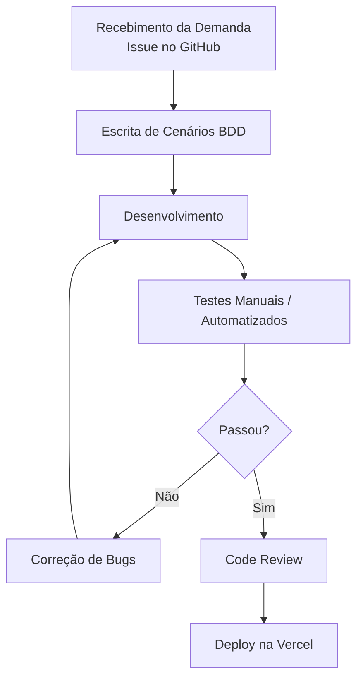

# Aula 14 - Qualidade de Processo

## 👥 Integrante

- Wesley Solisnande Santos Zorzolli

## 1. Mapeamento do Processo

### Fluxo Atual do Processo

## 2. Entradas, Atividades e Saídas

| Etapa | Entrada | Atividade | Saída |
|---------|---------|---------|---------|
| Recebimento da demanda | Issue no GitHub | Análise da tarefa e definição do que precisa ser feito | Tarefa entendida e organizada |
| Escrita de cenários BDD | Demanda da feature | Criar os cenários esperados antes de codar | Cenários BDD prontos |
| Desenvolvimento | Cenários BDD e regras da feature | Implementar a funcionalidade no sistema LocalEats | Código desenvolvido |
| Testes | Código pronto | Execução de testes manuais e automatizados | Evidências, falhas ou aprovação |
| Correções e deploy | Defeitos encontrados e código validado | Ajustar erros, revisar no code review e publicar na Vercel | Nova versão entregue |

## 3. Reflexão sobre o Processo

### 1. O processo utilizado por mim está claramente definido?

Eu diria que sim, pelo menos na forma como eu organizei a atividade. O GitHub Projects ajuda bastante porque deixa visível o que já foi feito, o que ainda está pendente e o que precisa ser ajustado.

### 2. Eu sigo sempre o mesmo fluxo de trabalho?

Sim, eu tento seguir a mesma sequência sempre. Às vezes eu acabo ajustando a ordem de alguma coisa por causa do tempo, mas a lógica principal continua a mesma.

### 3. Em quais etapas a qualidade é verificada?

A checagem começa antes mesmo de codar, nos cenários BDD, porque ali eu já deixo claro o comportamento esperado. Depois, eu confiro de novo nos testes, quando a funcionalidade já está pronta e precisa provar que realmente atende o esperado.

### 4. Quais melhorias poderiam tornar o processo mais eficiente?

- Separar melhor as tarefas pequenas para eu não ficar com uma issue grande demais de uma vez.
- Registrar um passo a passo simples do fluxo para reduzir dúvida na hora de começar.
- Fazer validação automática antes de enviar para produção, principalmente nos testes e no review.

### 5. Como a qualidade do processo impacta a qualidade do produto final?

Quando o processo é bem cuidado, o resultado aparece no produto. O LocalEats fica mais estável, eu refaço menos coisa e as chances de um erro simples virar problema para o usuário depois do deploy na Vercel diminuem bastante.

---

Wesley Solisnande Santos Zorzolli - 02 de junho de 2026
